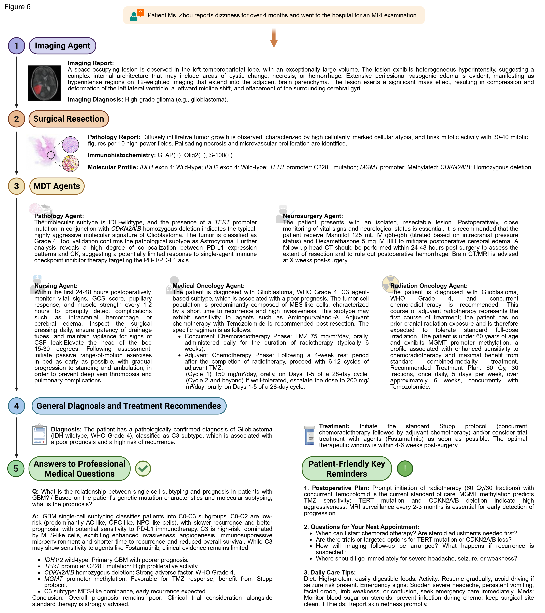

# BioPlexMDT

BioPlexMDT is a project framework for multi-source medical data retrieval, integration, and analysis. This repository keeps the main program source code, backend API, English frontend page, tool driver scripts, environment template, and a small test patient sample dataset.

## Directory Structure

| Path | Content |
|---|---|
| `src/` | Main program source code |
| `api/` | Backend service entry point |
| `web/` | English frontend page |
| `tools/` | Tool driver scripts and related requirements |
| `docs/PROMPT_FILLING_GUIDE.md` | Prompt filling guide |
| `Test patient sample data/` | Test patient sample data |
| `.env.example` | Environment variable template |
| `requirements.txt` | Main program requirements |

## System Requirements

| Item | Requirement |
|---|---|
| Operating system | Windows 10/11; RaSPr and ROAM are recommended under WSL Ubuntu |
| Main Python version | Python 3.10 or 3.11 |
| Tested GPU | NVIDIA GeForce RTX 5060 Ti |
| GPU requirement | The main service can run on CPU; GigaTIME, ROAM, and scRNA model inference are recommended on NVIDIA GPU |
| CUDA/PyTorch | Install the CUDA-enabled PyTorch version that matches the local NVIDIA driver |
| Memory and disk | 32 GB RAM or above is recommended; reserve additional disk space for model weights and sample data |

## Tool Environments

| Tool | Project Path | Environment and Version | Requirements File |
|---|---|---|---|
| Main program | `src/gbm_agent/` | Windows 10/11, Python 3.10 or 3.11 | `requirements.txt` |
| GigaTIME | `tools/GigaTIME/` | Windows 10/11, Conda environment `gigatime_check_1`, Python 3.11 | `tools/GigaTIME/requirements.txt` |
| RaSPr | `tools/raspr/` | WSL Ubuntu, Bash runtime environment | `tools/raspr/requirements.txt` |
| ROAM | `tools/ROAM/` | WSL Ubuntu, Conda environment `roam` | `tools/ROAM/requirements.txt` |
| scRNA/scMulan | `tools/scrna/` | Windows 10/11, Conda environment `scMulan`, Python 3.10 | `tools/scrna/requirements.txt` |

The four tool folders keep only the BioPlexMDT driver scripts, README files, and requirements files. Full third-party tool repositories, large intermediate files, training data, and most pretrained model weights are not stored in `tools/`.

## Installation

Install the main program dependencies:

```powershell
pip install -r requirements.txt
```

Install tool-specific dependencies only when the corresponding tool is needed:

```powershell
pip install -r tools/GigaTIME/requirements.txt
pip install -r tools/scrna/requirements.txt
pip install -r tools/raspr/requirements.txt
pip install -r tools/ROAM/requirements.txt
```

Different tools may require different dependency versions. Independent Conda environments are recommended.

## Environment Configuration

Copy the environment variable template:

```powershell
Copy-Item .env.example .env
```

Fill service URLs, API keys, model names, local retrieval paths, tool paths, and Conda environment names in `.env`.

If the API service or endpoint needs to be changed, follow the variable format in `.env.example`.

## Model Weights

This repository does not provide third-party model weights, except for the scRNA classifier weight if it is included in the local package.

For GigaTIME, ROAM, scRNA/scMulan, RaSPr, and other tools, pretrained weights should be obtained from the corresponding tool repository or related paper page, then placed according to the original tool instructions. External tool paths should be configured through the `BIOPLEX_*_EXTERNAL_*` variables in `.env.example`.

## Expected Installation Time

| Environment | Estimated Time |
|---|---|
| Main program dependencies | 5-10 minutes |
| GigaTIME environment | 20-40 minutes |
| RaSPr environment | 20-40 minutes |
| ROAM environment | 20-60 minutes |
| scRNA/scMulan environment | 15-30 minutes |
| Full environment setup | About 1-2 hours |

These estimates assume a standard desktop workstation with normal network access and existing Conda, WSL, and NVIDIA driver setup. First-time CUDA, PyTorch, or WSL setup may take longer.

## Expected Runtime

| Workflow | Estimated Time per Patient |
|---|---|
| Basic case question answering and local RAG retrieval | 3-8 minutes |
| MRI/DICOM workflow | 5-20 minutes |
| Pathology TIFF/GigaTIME workflow | 10-30 minutes |
| scRNA/scMulan workflow | 10-40 minutes |
| Full patient workflow | About 30-90 minutes |

Runtime depends on data size, model weights, API response speed, GPU memory, and actual tool input scale. The current estimate is based on NVIDIA GeForce RTX 5060 Ti.

## Local RAG Data

Place local RAG documents, guidelines, or notes in JSONL format under:

```text
src/gbm_agent/data/raw/
```

The default local guideline file is:

```text
src/gbm_agent/data/raw/open_guidelines.jsonl
```

Each line should be one JSON object. The main text field is recommended as `content`; `clean_text`, `raw_text`, `text`, `overview`, and `title` are also supported.

Example:

```json
{"title":"Example title","content":"Text content for local RAG retrieval.","source":"local"}
```

Build the general retrieval index:

```powershell
$env:PYTHONPATH="src"
python -m gbm_agent.build_index
```

If PubMed or trial fact data need to be added, place the file at:

```text
src/gbm_agent/data/raw/pubmed_gbm.jsonl
```

Build the fact index:

```powershell
$env:PYTHONPATH="src"
python -m gbm_agent.build_facts_index
```

Indexes are written to `src/gbm_agent/chroma_db/` by default. To change local data or index paths, edit `BIOPLEX_DATA_DIR` and `BIOPLEX_CHROMA_DB_DIR` in `.env`.

## Run

Start the backend service:

```powershell
python api/main.py
```

Default service address:

```text
http://localhost:8000
```

The frontend page is located in `web/` and can be accessed after startup:

```text
http://localhost:8000/index.html
```

For the actual analysis workflow, follow the guidance shown in the frontend interface.

## Answer Example


